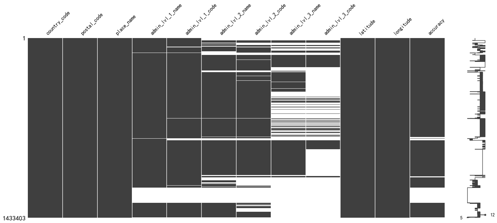

# geonames-postal-codes

The data is from geonames.

Several columns have been dropped to simplify the dataset.

## How to regenerate the data

1. Download the `allCountries.zip` from https://download.geonames.org/export/zip/
2. Transform the data using the `script/parse.py`.

## Missing Values in allCountries.zip

